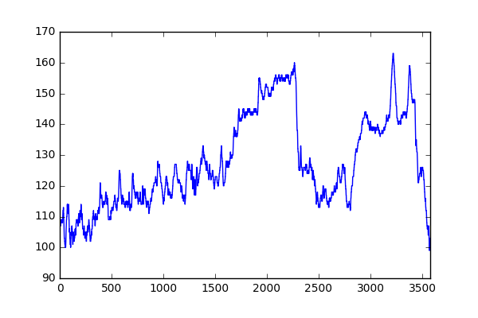

[](https://travis-ci.org/GoldenCheetah/sweatpy)

# Sweatpy

## Introduction
Sweatpy is a Python library that is designed to make workout analysis a breeze. The current state of the project is very beta: features might be added, removed or changed in backwards incompatible ways. When the time is right a stable version will be released. Get in touch with the contributors or create an issue if you have problems/questions/feature requests/special use cases.

## Installation
This library can be installed via PyPI:
```
pip install sweat
```

## Usage
The core feature of this library is the `WorkoutDataFrame`.
This class is a subclass of `pandas.DataFrame` and offers all the functionality that is available for this class, plus some workout specific functionality.

After installation, the `WorkoutDataFrame` can be imported this way:
```python
from sweat.models import WorkoutDataFrame
```

To load some example data from this repository:
```python
import pandas as pd
wdf = WorkoutDataFrame(pd.read_csv('./tests/fixtures/workout_1.csv'))
```

Basic operations on the data are provided by `pandas.Dataframe` superclass:
```python
wdf.power.mean()
>> 131.65231973169369
wdf.power.max()
>> 280
wdf.heartrate.plot()
```


For some workout specific functionality information about the athlete is needed.
This can be set on the `WorkoutDataFrame` as follows:
```python
from sweat.models import Athlete
wdf.athlete = Athlete(name='Chris Froome', cp=175, w_prime=20000)
```

When this is done for example the W'balance can be computed, added to the wdf and plotted:
```python
wdf = wdf.assign(w_prime_balance=wdf.compute_w_prime_balance())
wdf.w_prime_balance.plot()
```


It is also possible to compute and plot the mean max power for this workout:
```python
mean_max_power = wdf.compute_mean_max_power()
# Get the mean max power for 60 seconds
mean_max_power[60]
>> 215.03278688524591
mean_max_power.plot()
```


Another feature of this library is that you can create custom workout and for example analyze the W'balance of it:
```python
wdf = WorkoutDataFrame(dict(
    power=[100]*60 + [200]*120 + [100]*60
))
wdf.athlete = Athlete(cp=175, w_prime=20000)
wdf = wdf.assign(w_prime_balance=wdf.compute_w_prime_balance())
wdf.w_prime_balance_min()
>> 17320.207532891662
```

There are already more algorithms available on the `WorkoutDataFrame` such as alternatives for the Skiba W'balance algorithm.
More algorithms will be added later.

This documentation is quite compact at the moment but will be extended with more examples in the near future. Stay tuned!


## Contributing
Coming soon...

## Contributors
[Maksym Sladkov](https://github.com/sladkovm)
[Aart Goossens](https://github.com/AartGoossens)

## License
See [LICENSE](LICENSE) file.
